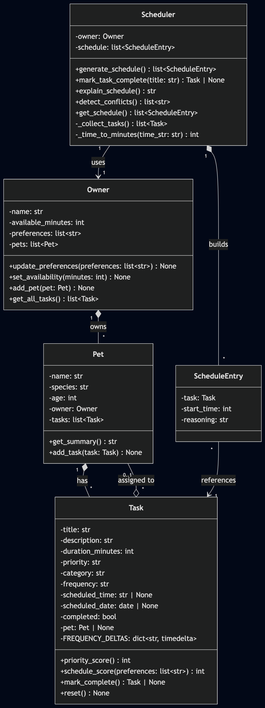

# PawPal+ (Module 2 Project)

You are building **PawPal+**, a Streamlit app that helps a pet owner plan care tasks for their pet.

## Scenario

A busy pet owner needs help staying consistent with pet care. They want an assistant that can:

- Track pet care tasks (walks, feeding, meds, enrichment, grooming, etc.)
- Consider constraints (time available, priority, owner preferences)
- Produce a daily plan and explain why it chose that plan

Your job is to design the system first (UML), then implement the logic in Python, then connect it to the Streamlit UI.

## What you will build

Your final app should:

- Let a user enter basic owner + pet info
- Let a user add/edit tasks (duration + priority at minimum)
- Generate a daily schedule/plan based on constraints and priorities
- Display the plan clearly (and ideally explain the reasoning)
- Include tests for the most important scheduling behaviors

## Getting started

### Setup

```bash
python -m venv .venv
source .venv/bin/activate  # Windows: .venv\Scripts\activate
pip install -r requirements.txt
```

### Suggested workflow

1. Read the scenario carefully and identify requirements and edge cases.
2. Draft a UML diagram (classes, attributes, methods, relationships).
3. Convert UML into Python class stubs (no logic yet).
4. Implement scheduling logic in small increments.
5. Add tests to verify key behaviors.
6. Connect your logic to the Streamlit UI in `app.py`.
7. Refine UML so it matches what you actually built.

## Features

1. **Sorting by time** -- Tasks are sorted chronologically by their `scheduled_time` (HH:MM). Tasks without a time slot are placed at the end. When two tasks share the same time, the scheduler breaks the tie using a computed score based on priority and owner preferences.

2. **Preference-aware scoring** -- Each task receives a scheduling score: a base priority value (low=1, medium=2, high=3) plus a +2 bonus if its category matches one of the owner's preferred categories. Higher-scoring tasks are scheduled first when times are equal.

3. **Greedy time-budget fitting** -- The scheduler walks through sorted tasks and greedily assigns each one if its duration fits within the owner's remaining available minutes. Tasks that don't fit are skipped and reported at the end.

4. **Daily and weekly recurrence** -- Completing a task with `frequency="daily"` or `"weekly"` automatically creates a new task with the next `scheduled_date` (current date + 1 day or + 7 days). The new task is assigned to the same pet and starts as incomplete. One-time tasks produce no follow-up.

5. **Conflict detection** -- Before displaying the schedule, the app checks every pair of timed tasks for overlap using the condition `a_start < b_end and b_start < a_end`. Conflicts are surfaced as warnings that identify both tasks, their time ranges, and whether they belong to the same pet or different pets.

6. **Schedule reasoning** -- Each scheduled task includes an explanation string describing why it was placed in that position (priority score, preference match, pet assignment), viewable in an expandable "Why this order?" section.

7. **Multi-pet support** -- An owner can have multiple pets, each with their own task list. The scheduler pulls tasks from all pets via `Owner.get_all_tasks()` and interleaves them into a single unified daily plan.

## Smarter Scheduling

The scheduler in `pawpal_system.py` includes four algorithmic improvements beyond basic priority ordering:

- **Sort by time** -- Tasks with a `scheduled_time` (`"HH:MM"` format) are sorted chronologically using a lambda key that compares time strings lexicographically, with priority score as a tiebreaker.
- **Preference-aware scoring** -- `Task.schedule_score()` combines the base priority (1-3) with a +2 bonus when the task category matches an owner preference, so preferred care areas float to the top.
- **Recurring tasks** -- When a `"daily"` or `"weekly"` task is marked complete, `mark_complete()` uses `timedelta` to compute the next date and automatically creates a new Task instance assigned to the same pet.
- **Conflict detection** -- `Scheduler.detect_conflicts()` performs a pairwise overlap check (`a_start < b_end and b_start < a_end`) on all timed tasks and returns human-readable warnings identifying same-pet and cross-pet conflicts without crashing the program.

## Testing PawPal+

### Running tests

```bash
python -m pytest
```

For verbose output showing each test name and result:

```bash
python -m pytest -v
```

### What the tests cover

The test suite in `tests/test_pawpal.py` verifies eight behaviors across four areas:

| Area | Tests | What they check |
|------|-------|-----------------|
| **Core operations** | `test_mark_complete_changes_status`, `test_add_task_increases_pet_task_count` | Marking a task complete flips its status; adding tasks grows the pet's task list |
| **Sorting correctness** | `test_schedule_sorted_by_time`, `test_schedule_tiebreak_by_score` | Tasks are scheduled in chronological order; ties are broken by priority + preference score |
| **Recurrence logic** | `test_daily_recurrence_creates_next_day_task`, `test_onetime_task_returns_none` | Daily tasks generate a next-day follow-up on completion; one-time tasks do not |
| **Conflict detection** | `test_detect_conflicts_overlapping_tasks`, `test_no_conflict_for_adjacent_tasks` | Overlapping time ranges produce a warning; back-to-back tasks do not |

### Confidence level

**Reliability: 4/5 stars**

The tests cover the core scheduling logic, recurrence, and conflict detection -- the features most likely to break. One star is withheld because edge cases like zero available minutes, tasks with no scheduled time, and multi-pet cross-conflict scenarios are not yet covered.


# DEMO

<a href="uml_final.png" target="_blank"></a>